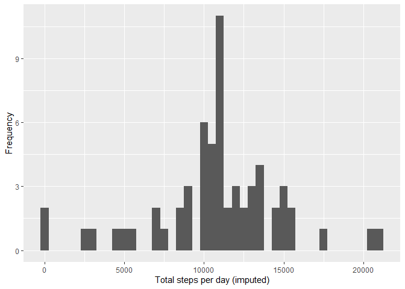

## Loading and preprocessing the data
##### 1. Load the data (i.e. read.csv())

```r
unzip(zipfile="activity.zip")
data <- read.csv("activity.csv")
```

##### 2. Process/transform the data (if necessary) into a format suitable for your analysis

```r
data_good <- subset(data, !is.na(data$steps))
```

## What is mean total number of steps taken per day?

```r
steps_per_day <- tapply(data_good$steps, data_good$date, FUN = sum)
```
##### 1. Make a histogram of the total number of steps taken each day


```r
qplot(steps_per_day, binwidth=500, ylab = "Frequency", xlab="Total steps per day")
```

<!-- -->

##### 2. Calculate and report the mean and median total number of steps taken per day


```r
steps_per_day_mean <- format(round(mean(steps_per_day),2), nsmall = 2)
steps_per_day_median <- format(round(median(steps_per_day),2), nsmall = 2)
```
* Mean : 10766.19
* Median : 10765.00

## What is the average daily activity pattern?


```r
average_daily_pattern <- aggregate(x=list(steps=data$steps), 
                      by=list(interval = data$interval),
                      FUN = mean, na.rm=TRUE)
```

##### 1. Make a time series plot

```r
ggplot(average_daily_pattern, aes(x=interval, y=steps)) +
            geom_line() + labs(title = "Time series of average steps", 
                                x = "5 min intervals", y = "Average steps taken")
```

<!-- -->

##### 2. Which 5-minute interval, on average across all the days in the dataset, contains the maximum number of steps?


```r
max_steps_interval <- average_daily_pattern[which.max(average_daily_pattern$steps), "interval"]
```
* Maximum steps in interval : 835

## Imputing missing values

##### 1. Calculate and report the total number of missing values in the dataset


```r
missing_values_count <- length(which(is.na(data$steps)))
```

* Number of missing values : 2304

##### 2. Devise a strategy for filling in all of the missing values in the dataset.

* Strategy - Filling the missing values with mean value of 5 min interval.

##### 3. Create a new dataset that is equal to the original dataset but with the missing data filled in.


```r
filled_data <- data
fill_values <- function (step, interval) {
  filled_step <- step
  if (is.na(step)) {
    filled_step <- average_daily_pattern[average_daily_pattern$interval == interval, "steps"]
  }
  return (filled_step)
}
filled_data$steps <- mapply(fill_values, data$steps, data$interval)
```

##### 4.a Make a histogram of the total number of steps taken each day 

```r
steps_per_day_imputed <- tapply(filled_data$steps, filled_data$date, FUN = sum)
qplot(steps_per_day_imputed, binwidth=500, ylab = "Frequency", xlab="Total steps per day (imputed)")
```

<!-- -->

##### 4.b Calculate and report the mean and median total number of steps taken per day. 

```r
steps_per_day_imputed_mean <- format(round(mean(steps_per_day_imputed),2), nsmall = 2)
steps_per_day__imputed_median <- format(round(median(steps_per_day_imputed),2), nsmall = 2)
```
* Mean : 10766.19
* Median : 10766.19

## Are there differences in activity patterns between weekdays and weekends?

##### 1. Create a new factor variable in the dataset with two levels – “weekday” and “weekend” indicating whether a given date is a weekday or weekend day.

```r
filled_data$dayType <- ifelse(as.POSIXlt(filled_data$date)$wday 
                              %in% c(1,2,3,4,5), "weekday", "weekend")
```

##### 2. Make a panel plot containing a time series plot


```r
average_daily_pattern_imputed <- aggregate(steps ~ interval + dayType,
                                           filled_data, FUN = mean)
ggplot(average_daily_pattern_imputed, aes(interval, steps)) + 
  geom_line() + facet_grid(dayType~.) + labs(x = "Interval", 
                                             y = "Number of steps")
```

<!-- -->
